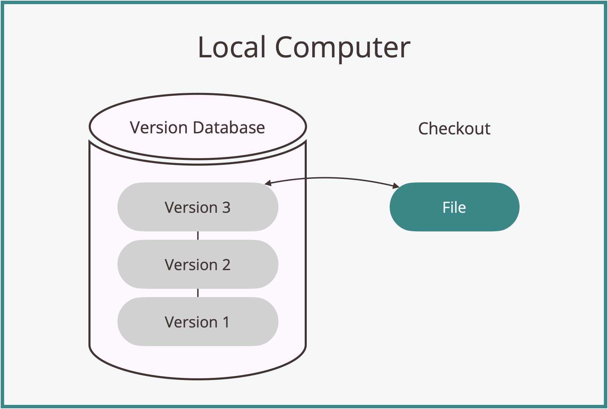
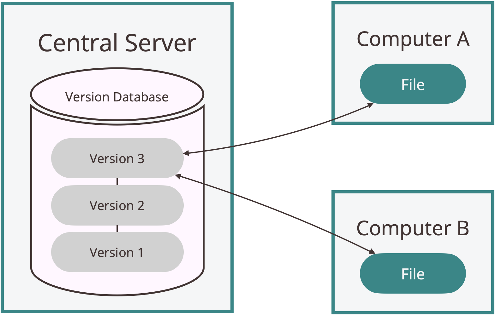

# On Version Control

> "There are two types of people: those who backup their files, and those who will."
> *—Programming Wisdom*

The consequences of poor version management go far beyond mild inconvenience.
Overwritten files force teams to reconstruct work from memory.
Unclear change histories cause deployment failures and costly downtime.
Solo developers lose working solutions, knowing they functioned yesterday, but unable to recover the critical modifications they made.
These scenarios aren't outliers; they're inevitable when file evolution lacks intention.

Let’s examine how version control offers practical solutions to these challenges as projects evolve.
**Version Control Systems (VCSs)** are tools that track and manage file changes across a project's lifecycle.
They function as comprehensive change management tools, letting you revert to previous versions while maintaining a complete audit trail: what changed, when, who made the change, and why.

---

## What You'll Learn

By the end of this section, you'll understand:

- The core problems that make version control essential for any evolving project

- The architectural evolution of version control systems

- Key trade-offs between different VCS architectures and why distributed systems, like Git, have become the industry standard

---

## Challenges Version Control Meets

VCSs address three core problems in evolving projects:

1. **Historical challenges:** Preserving a complete record of how your project has evolved over time

2. **Collaborative challenges:** Coordinating seamlessly when multiple people work on the same project simultaneously

3. **Branching challenges:** Managing experimental work and parallel development efforts without losing control

These problems exist in various forms, whether you're a solo developer on a weekend project or part of a thousand-person engineering team building enterprise software.
Let’s break down these three challenge categories and see their impact in practice.

### Historical Challenges

The first problem VCSs are designed to solve is maintaining a complete record of a project's history.
This includes knowing what changed, when it was changed, why it was changed, and who made the change.

*Picture this:* You're building a simple task manager application.
It starts with basic functionality:

```python
# task_manager.py
def add_task(title, description):
    # Save task to file
    ...

def mark_complete(task_id):
    # Mark task as done
    ... 

def list_tasks():
    # Show all tasks
    ...
```

> **Note:** This course uses programming examples to illustrate concepts, but no specific programming knowledge is required.
> The principles of version control apply to nearly any type of file on your computer: code, documents, designs, data, etc.

As you continue with development, adding features like due dates and priority levels, you want to keep previous versions "just in case."
Just in case something breaks, gets lost, or becomes corrupted.

Soon, your project directory looks like this:

```
.
├── task_manager_final_final.py
├── task_manager_final_old.py
├── task_manager_final.py
├── task_manager_old.py
├── task_manager_v2.py
└── task_manager.py
```

You have six files, three of which contain the word "final."
**Which one actually works?**

You'll waste time opening files to figure out which has the features you need, and you'll hesitate to delete old versions because, after all, *"I might need them later."*

Perhaps you get clever with timestamps, naming your files: `task_manager_20250919.py`, `task_manager_20250922.py`.
This helps with organization, but fundamental problems persist.
You still can't easily see what changed between versions, can't remember why you made specific changes, and use unnecessary disk space with near-duplicate files.
Manual versioning doesn't scale, and human memory is unreliable for tracking code evolution.

### Collaborative Challenges

The second problem VCSs are designed to solve is collaboration among teammates.
How can multiple people edit the same project simultaneously without creating irritating conflicts?

*Now picture* you're working on the task manager application with a teammate.
You email them your latest `task_manager.py`, and you both start adding features simultaneously.
Your teammate emails back `task_manager_modified.py` with their changes.

Here's where things get messy.
Your version has:

```python
def add_task(title, description):
    # Basic task creation
    ...
```

Your teammate's version has:
```python
def add_task(title, description, priority="medium"):
    # They've added priority levels
    ...
```

Additionally, your teammate introduced a completely new function that you were unaware of.
**How do you reconcile these changes?**

You're forced into manual file comparison, copying and pasting code snippets, hoping you don't miss anything important or accidentally overwrite working functionality.
This process becomes significantly more complex with the addition of more collaborators and larger projects.

Changes can get lost during manual merging, conflicting modifications can create bugs, and there is no systematic record of who made changes, what they were, or when.
When issues arise, identifying their source becomes a time-consuming search through email threads and file timestamps.

### Branching Challenges

The third problem VCSs are designed to solve is experimentation without fear.
How can we experiment with a project without the constant worry of breaking everything beyond repair?

*Imagine* you want to experiment with a major refactoring.
Instead of standalone functions, perhaps you want to abstract into a `TaskManager` class:

```python
class TaskManager:
    def __init__(self):
        self.tasks = []

    def add_task(self, title, description):
        # Add a task
        ...
```

**What if this experiment fails?**
What if you break everything and can't get back to your working version?
What if your teammate discovers a critical bug that needs immediate fixing while you're mid-experiment?
What if a Tyrannosaurus Rex comes and stomps on your car?

The manual versioning approach fails spectacularly in all of these scenarios.
It forces you to make a complete copy of your project folder and name it something like `task_manager_backup` or `critical_bugfix_copy`.
However, now you have multiple sources of "truth" scattered across your file system.
When your teammate needs to fix that critical bug, which version do they work on?
How do you ensure their fix propagates into your experimental branch?
How do you keep track of which changes belong where?

With manual versioning, there is no clear record of what your experiment was trying to accomplish.
If you want to keep only parts of your experimental changes, you're back to manual file comparison.
When working with others, coordination becomes a nightmare of shared drives and email attachments.

Without a systematic way to branch, experiment, and merge changes back together, innovation becomes paralyzing.
You either avoid trying new approaches altogether, or you spend significant time creating elaborate backup schemes that still don't solve the fundamental problem of safely exploring different solutions in parallel.

---

These three types of challenges—historical tracking, collaboration coordination, and safe experimentation—have driven the evolution of version control systems over the past four decades.
Each generation of VCS emerged to address the limitations of its predecessor, creating an architectural progression that mirrors the growing complexity of software development itself.

Understanding this evolution helps clarify not just *what* different systems do, but *why* they work the way they do.

---

## Types of Version Control Systems

Version control systems can be primarily classified into three distinct architectures: *local*, *centralized*, and *distributed*.
Each architecture emerged to address technological and collaborative constraints of its era.
We'll trace their evolution chronologically.

### Local Version Control Systems

As we established earlier, the most basic approach to version control involves manually copying files with variations such as `document.txt`, `document_old.txt`, and `document_final.txt`.
While intuitive, this method creates organizational chaos and offers no systematic way to track changes or their rationale.

**Local version control systems** were developed by our early human ancestors in the 1980s to solve these problems.
A local VCS maintains a structured repository on an individual machine, automatically tracking modifications and storing complete version histories.



Among the most influential local VCSs was RCS (Revision Control System), developed in 1982 at Purdue University by Walter F. Tichy.
RCS stored incremental changes, called deltas, between file versions.
Instead of maintaining multiple complete copies of a document, RCS stored one base version plus the deltas needed to recreate each subsequent version.

While local VCSs solved individual workflow problems, their collaboration limitations created demand for more sophisticated collaborative systems.

### Centralized Version Control Systems

The next evolution came with **centralized version control systems**, which addressed the collaboration problem that plagued local VCSs.
Centralized systems, such as CVS (Concurrent Versions System), Subversion (SVN), and Perforce, use a single server to store the complete version history of the project.
Developers checkout files from this central repository, make modifications, and commit those changes back to the central repository.



With the centralized approach, multiple developers could work on the same project simultaneously, with the server coordinating changes and preventing conflicts.
Administrators gained fine-grained control over who could access which parts of the codebase.
The centralized nature also made backup and maintenance more manageable since there was only one authoritative source to protect.

However, centralized systems introduced their own set of challenges.
The central server became a single point of failure; if it went down, nobody could collaborate or save versioned changes to their work.
Network connectivity became essential for any operation.
Additionally, since each client maintained only the current snapshot of files (not the full history), developers were heavily dependent on the server for operations such as viewing change history or comparing versions.

### Distributed Version Control Systems

The limitations of centralized systems led to the development of **distributed version control systems** in the early 2000s.
Systems like Git and Mercurial fundamentally changed how developers conceptualize version control.

In a distributed model, every client maintains a complete copy of the project history, not just the current snapshot.
When you clone a repository, you get the full backup of all the data.
This means that if any server dies, any of the client repositories can be copied back to restore it.


With the distributed approach, developers can work offline, committing changes and viewing history without network access.
Multiple backup copies naturally exist, as every clone is a full backup.
Teams can establish multiple workflows; they might have several remote repositories for different purposes, or developers might share changes directly between their repositories without going through a central server.

This flexibility comes with complexity, as teams need clear workflows for how changes flow between repositories, which this course addresses.
The robustness and flexibility of distributed systems have made them the dominant choice for modern software development, with Git becoming nearly ubiquitous in the industry.

---

## Next Steps

Understanding version control architecture explains why Git became the industry standard, but not why it surpassed other distributed VCS competitors like Mercurial and Bazaar.
In our next section, **"Git's Competitive Advantage,"** we'll examine the design philosophy that made Git uniquely successful.

---

## Summary

Version control systems are essential infrastructure for any project involving multiple files, iterations, or collaborators.
VCSs address three fundamental challenges in iterative development:

1. **Historical tracking:** What changed, when, by whom, and why?

2. **Collaboration:** How can multiple developers work simultaneously without conflicts?

3. **Parallel development:** How can we experiment safely without breaking the main system?

Three primary VCS architectures evolved sequentially to address these needs, each addressing limitations of its predecessor:

1. **Local VCS:** Database-driven change tracking on individual machines

2. **Centralized VCS:** Server-based repository managing all project changes

3. **Distributed VCS:** Complete local repositories with distributed synchronization capabilities

Modern development relies on distributed systems like Git, which combine the benefits of the two other approaches.

---

*© 2025 Ryan Baker ~ Licenced under [CC BY-SA 4.0](https://creativecommons.org/licenses/by-sa/4.0) ~ Modified: September 24, 2025*
