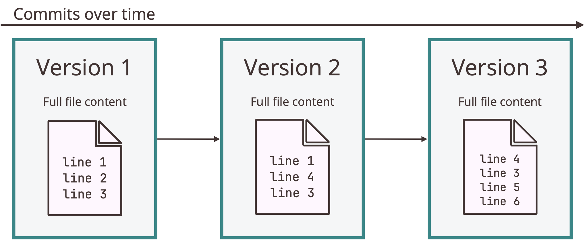

# Git's Competitive Advantage

> "Git isn't just a version control system; it's a framework of trust.
> A record of vision.
> A space where every branch reflects thought, and every commit carries intent."
> *—Mohamed Yasser*

In the spring of 2005, Linus Torvalds found himself facing an unexpected crisis.
The Linux kernel project, which had grown from his personal experiment into a global collaboration involving thousands of developers, was suddenly without its version control system.
BitKeeper, the proprietary tool that had managed the kernel's development for three years, was no longer available to the open-source community after a licensing dispute.
With characteristic pragmatism and a touch of impatience, Torvalds surveyed the existing alternatives, such as CVS, Subversion, and found them all lacking.
They were too slow, too centralized, or simply inadequate for the scale and distributed nature of the Linux kernel development.

Rather than compromise or wait for someone else to solve the problem, Torvalds embarked on a two-week coding sprint that would produce the initial version of Git.
Drawing inspiration from his experience with BitKeeper's distributed model while rejecting its complexity, he designed a system that was blindingly fast, completely distributed, and robust enough to handle the kernel's sprawling development process.
By April 2005, Git was managing its own source code, and within months it had proven itself capable of handling one of the world's most complex software projects, setting the stage for its eventual dominance in the version control landscape.

---

## What You'll Learn

---

## Git's Design Philosophy

When Torvalds set out to build Git, he wasn't simply creating another version control system.
He was solving specific problems that had frustrated him during Linux kernel development, problems that existing tools failed to adequately address.

Git's design reflects three core priorities that distinguished it from competitors:

1. **Speed at scale:**
The Linux kernel repository contained thousands of files and years of history.
Git needed to handle operations likes commits, branches, and merges in seconds, not mnutes.
This requirement influenced every architectureal decision, from how Git stores data to how it tracks changes.

2. **Distributed integrity:**
With thousands of developers worldwide contributing code, Git needed cryptographic guarantees that repository history couldn't be corrupted or tampered with, whether accidentally or maliciously.
Every object in Git is checksummed, making it virtually impossible to change any file, date, or commit message without Git detecting it.

3. **Non-linear development:**
Kernel development involved hundreds of experimental branches being created, modified, and merged daily.
Git needed to make branching and merging so lightweight and reliable that developers wouldn't hesitate to create branches for even minor experiments.

These priorities led to architectural choices that differentiate Git from both its predecessors and its distributed contemporaries.

### Thinking in Snapshots

The most fundamental distinction between Git and nearly every other VCS lies in how it conceptualizes data.
Most systems, including CVS, Subversion, and Perforce, store information as a list of file-based changes.
They maintain a base version of each file, then record the differences (deltas) between successive versions. This is commonly known as *delta-based version control.*

When you want version 5 of a file, the system starts with the base version and sequentially applies delta 1, then delta 2, then delta 3, and so on until it reconstructs the version you requested.
This approach seems intuitive because it mirrors how we conceptualize file modifications and appears space-efficient.

Git rejects this model entirely.
Instead of storing deltas, Git takes a complete snapshot of your project at each version.
When you *commit* a version, Git captures a snapshot of what every file in your project looks like at that precise moment and stores a reference to that snapshot.
This means Git conceptualizes its data as a stream of snapshots, not as a series of incremental changes.

This architectural decision has profound implications for performance and workflow.
When you check out a previous version of your project, Git doesn't need to reconstruct it by walking through a chain of deltas.
It simply retrieves the snapshot directly.
This makes operations like switching branches, viewing history, or comparing versions extraordinarily fast.
Even in repositories with thousands of files and years of history, these operations typically complete in milliseconds.

### Builtin Integrity

Every piece of data in git is checksummed before it is stored then referred to by that checksum.
This means it's impossible to change the contents of any file or directory in a Git project without Git knowing about it.

The mechanism Git uses for checksumming is a SHA-1 hash. This is a 40 character hexadecimal string (0-9 and a-f) and is calculated based off the contents of a file or directory structure in Git.

---

## The Three File States

Intuitively, one would expect a version control system to manage files in two states: **modified** or **unmodified**.
On a commit, the system would mark the changes and call every file unmodified.
Git, on the other hand, adds an intermediate stage that allows for more fine grained control over commits and workflow. The three distinct states are:

1. **Modified:** You've changed a file but haven't yet told Git to record that change.

2. **Staged:** You've marked a file in its current state to go into your next snapshot. This is the intermediate stage.

3. **Committed:** The data is stored in your local Git repository. This is equivalent to an "unmodified" state.

---

## Next Steps

---

## Summary

---

*© 2025 Ryan Baker ~ Licenced under [CC BY-SA 4.0](https://creativecommons.org/licenses/by-sa/4.0) ~ Modified: September 24, 2025*
